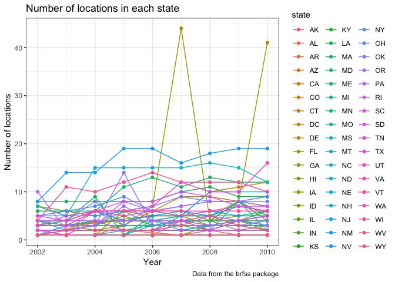

p8105\_hw3\_ym2715
================
Yizhi Ma
10/15/2018

Problem 1
---------

``` r
brfss_smart2010 = p8105.datasets::brfss_smart2010

brfss_overall_health = brfss_smart2010 %>% 
  janitor::clean_names() %>% 
  rename(state = locationabbr) %>% 
  select(year, state, location_desc = locationdesc, topic, response, data_value) %>% 
  filter(topic == "Overall Health") %>% 
  filter(response == "Excellent" | response == "Very good" | response == "Good" | response == "Fair" | response == "Poor") %>% 
  arrange(factor(response, c("Excellent", "Very good", "Good", "Fair", "Poor"))) 
```

Question 1

``` r
brfss_overall_health %>% 
  filter(year == 2002) %>% 
  distinct(location_desc, .keep_all = TRUE) %>% 
  group_by(state) %>% 
  mutate(location_num = n()) %>% 
  distinct(state, location_num) %>% 
  filter(location_num == 7) %>% 
  knitr::kable()  
```

| state |  location\_num|
|:------|--------------:|
| CT    |              7|
| FL    |              7|
| NC    |              7|

In 2002, CT, FL, NC were observed at 7 locations.

``` r
spaghetti = brfss_overall_health %>% 
  select(year, state, location_desc) %>% 
  distinct(year, location_desc, .keep_all = TRUE) %>% 
  group_by(state, year) %>% 
  mutate(location_num = n()) %>% 
  distinct(year, state, location_num)

ggplot(spaghetti, aes(x= year, y = location_num, color = state)) +
  geom_point() +
  geom_line()
```



``` r
ny_response = brfss_overall_health %>% 
  filter(state == "NY" & response == "Excellent") %>% 
  filter(year %in% c(2002, 2006, 2010)) 

ny_mean = aggregate(ny_response[, 6], list(ny_response$location_desc), mean) %>% 
  rename(mean = data_value, location = Group.1)
ny_sd = aggregate(ny_response[, 6], list(ny_response$location_desc), sd) %>% 
  rename(sd = data_value, location = Group.1)
ny_mean_sd = left_join(ny_mean, ny_sd, by = "location")

knitr::kable(ny_mean_sd)
```

| location                |      mean|         sd|
|:------------------------|---------:|----------:|
| NY - Bronx County       |  17.60000|         NA|
| NY - Erie County        |  17.20000|         NA|
| NY - Kings County       |  20.36667|  1.7672955|
| NY - Monroe County      |  22.40000|         NA|
| NY - Nassau County      |  24.93333|  2.8219379|
| NY - New York County    |  27.50000|  1.5394804|
| NY - Queens County      |  19.63333|  1.3576941|
| NY - Suffolk County     |  24.10000|  3.2787193|
| NY - Westchester County |  26.45000|  0.6363961|

Problem2
--------

``` r
instacart = p8105.datasets::instacart %>% 
  janitor::clean_names()
```

``` r
aisle_order = instacart %>% 
  group_by(aisle) %>% 
  mutate(order_count = n()) %>% 
  select(aisle, order_count) %>% 
  distinct(aisle, .keep_all = TRUE) %>% 
  arrange(desc(order_count))
```

There are 134 aisles, and fresh vegetables is the onr that most items ordered from.

``` r
popular_item = instacart %>% 
  select(aisle, product_name) %>% 
  filter(aisle == "baking ingredients" | aisle == "dog food care" | aisle == "packaged vegetables fruits") %>% 
  group_by(product_name) %>% 
  mutate(item_count = n()) %>% 
  distinct(product_name, .keep_all = TRUE) %>% 
  arrange(aisle, product_name) 

popular_item %>% 
  group_by(aisle) %>%
  summarize(max_item_name = product_name[which.max(item_count)], max_item_count = max(item_count)) %>% 
  knitr::kable()
```

| aisle                      | max\_item\_name                               |  max\_item\_count|
|:---------------------------|:----------------------------------------------|-----------------:|
| baking ingredients         | Light Brown Sugar                             |               499|
| dog food care              | Snack Sticks Chicken & Rice Recipe Dog Treats |                30|
| packaged vegetables fruits | Organic Baby Spinach                          |              9784|

``` r
apple_and_ice = instacart %>% 
  filter(product_name == "Pink Lady Apples" | product_name == "Coffee Ice Cream") %>% 
  select(product_name, order_dow, order_hour = order_hour_of_day) %>% 
  group_by(order_dow) %>% 
  summarise(mean_hour = mean(order_hour)) %>% 
  mutate(mean_hour = round(mean_hour, digits = 1)) 

apple_and_ice$order_dow = recode(apple_and_ice$order_dow, 
                                 "0" = "Sunday",
                                 "1" = "Monday",
                                 "2" = "Tuesday",
                                 "3" = "Wednesday",
                                 "4" = "Thursday",
                                 "5" = "Friday",
                                 "6" = "Saturday")

apple_and_ice %>% 
  rename(day_of_week = order_dow,
         order_time = mean_hour) %>% 
  knitr::kable()
```

| day\_of\_week |  order\_time|
|:--------------|------------:|
| Sunday        |         13.6|
| Monday        |         12.2|
| Tuesday       |         12.8|
| Wednesday     |         14.7|
| Thursday      |         13.2|
| Friday        |         12.6|
| Saturday      |         13.2|
