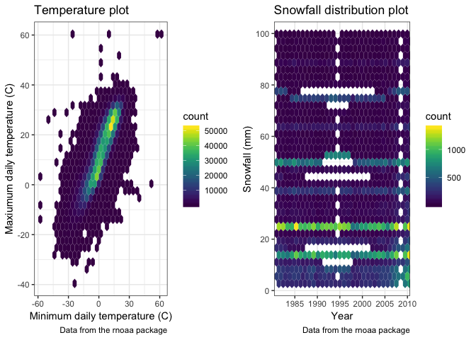

p8105\_hw3\_ym2715
================
Yizhi Ma
10/15/2018

Problem 1
---------

``` r
brfss_smart2010 = p8105.datasets::brfss_smart2010

brfss_overall_health = brfss_smart2010 %>% 
  janitor::clean_names() %>% 
  rename(state = locationabbr) %>% 
  select(year, state, location_desc = locationdesc, topic, response, data_value) %>% 
  filter(topic == "Overall Health") %>% 
  filter(response == "Excellent" | response == "Very good" | response == "Good" | response == "Fair" | response == "Poor") %>% 
  arrange(factor(response, c("Excellent", "Very good", "Good", "Fair", "Poor"))) 
```

Question 1

``` r
brfss_overall_health %>% 
  filter(year == 2002) %>% 
  distinct(location_desc, .keep_all = TRUE) %>% 
  group_by(state) %>% 
  mutate(location_num = n()) %>% 
  distinct(state, location_num) %>% 
  filter(location_num == 7) %>% 
  knitr::kable(col.names = c("State", "Number of locations"), align = "c")  
```

| State | Number of locations |
|:-----:|:-------------------:|
|   CT  |          7          |
|   FL  |          7          |
|   NC  |          7          |

In 2002, CT, FL, NC were observed at 7 locations.

Question 2

``` r
spaghetti = brfss_overall_health %>% 
  select(year, state, location_desc) %>% 
  distinct(year, location_desc, .keep_all = TRUE) %>% 
  group_by(state, year) %>% 
  mutate(location_num = n()) %>% 
  distinct(year, state, location_num)

ggplot(spaghetti, aes(x= year, y = location_num, color = state)) +
  geom_point() +
  geom_line() +
  labs(
    title = "Number of locations in each state",
    y = "Number of locations",
    x = "Year",
    caption = "Data from the brfss package"
  ) +
  theme_bw()
```


Question 3

``` r
ny_response = brfss_overall_health %>% 
  filter(state == "NY" & response == "Excellent") %>% 
  filter(year %in% c(2002, 2006, 2010)) 

ny_mean = aggregate(ny_response[, 6], list(ny_response$location_desc), mean) %>% 
  rename(mean = data_value, location = Group.1)
ny_sd = aggregate(ny_response[, 6], list(ny_response$location_desc), sd) %>% 
  rename(sd = data_value, location = Group.1)
ny_mean_sd = left_join(ny_mean, ny_sd, by = "location") %>% 
  mutate(mean = round(mean, digits = 1), sd = round(sd, digits = 2))

knitr::kable(ny_mean_sd, format = "html", align = "l", caption = "Mean and sd of “Excellent” responses across locations in NY State")
```

<table>
<caption>
Mean and sd of “Excellent” responses across locations in NY State
</caption>
<thead>
<tr>
<th style="text-align:left;">
location
</th>
<th style="text-align:left;">
mean
</th>
<th style="text-align:left;">
sd
</th>
</tr>
</thead>
<tbody>
<tr>
<td style="text-align:left;">
NY - Bronx County
</td>
<td style="text-align:left;">
17.6
</td>
<td style="text-align:left;">
NA
</td>
</tr>
<tr>
<td style="text-align:left;">
NY - Erie County
</td>
<td style="text-align:left;">
17.2
</td>
<td style="text-align:left;">
NA
</td>
</tr>
<tr>
<td style="text-align:left;">
NY - Kings County
</td>
<td style="text-align:left;">
20.4
</td>
<td style="text-align:left;">
1.77
</td>
</tr>
<tr>
<td style="text-align:left;">
NY - Monroe County
</td>
<td style="text-align:left;">
22.4
</td>
<td style="text-align:left;">
NA
</td>
</tr>
<tr>
<td style="text-align:left;">
NY - Nassau County
</td>
<td style="text-align:left;">
24.9
</td>
<td style="text-align:left;">
2.82
</td>
</tr>
<tr>
<td style="text-align:left;">
NY - New York County
</td>
<td style="text-align:left;">
27.5
</td>
<td style="text-align:left;">
1.54
</td>
</tr>
<tr>
<td style="text-align:left;">
NY - Queens County
</td>
<td style="text-align:left;">
19.6
</td>
<td style="text-align:left;">
1.36
</td>
</tr>
<tr>
<td style="text-align:left;">
NY - Suffolk County
</td>
<td style="text-align:left;">
24.1
</td>
<td style="text-align:left;">
3.28
</td>
</tr>
<tr>
<td style="text-align:left;">
NY - Westchester County
</td>
<td style="text-align:left;">
26.4
</td>
<td style="text-align:left;">
0.64
</td>
</tr>
</tbody>
</table>
Problem2
--------

``` r
instacart = p8105.datasets::instacart %>% 
  janitor::clean_names()
```

This is a 15 x 1,384,617 data frame, which contains properties about online orders. It has information about the order item it self: its name, id, aisle, etc. And it also povide us information about the order, like when the order is places, is it a reorder, etc.

Question 1

``` r
aisle_order = instacart %>% 
  group_by(aisle) %>% 
  mutate(order_count = n()) %>% 
  select(aisle, order_count) %>% 
  distinct(aisle, .keep_all = TRUE) %>% 
  arrange(desc(order_count))
```

There are 134 aisles, and fresh vegetables is the onr that most items ordered from.

Question 3

``` r
popular_item = instacart %>% 
  select(aisle, product_name) %>% 
  filter(aisle == "baking ingredients" | aisle == "dog food care" | aisle == "packaged vegetables fruits") %>% 
  group_by(product_name) %>% 
  mutate(item_count = n()) %>% 
  distinct(product_name, .keep_all = TRUE) %>% 
  arrange(aisle, product_name) 

popular_item %>% 
  group_by(aisle) %>%
  summarize(max_item_name = product_name[which.max(item_count)], max_item_count = max(item_count)) %>% 
  knitr::kable(format = "html",col.names = c("Aisle", "Most popular item", "Count"), align = "l", caption = "Most popular item in these three aisles")
```

<table>
<caption>
Most popular item in these three aisles
</caption>
<thead>
<tr>
<th style="text-align:left;">
Aisle
</th>
<th style="text-align:left;">
Most popular item
</th>
<th style="text-align:left;">
Count
</th>
</tr>
</thead>
<tbody>
<tr>
<td style="text-align:left;">
baking ingredients
</td>
<td style="text-align:left;">
Light Brown Sugar
</td>
<td style="text-align:left;">
499
</td>
</tr>
<tr>
<td style="text-align:left;">
dog food care
</td>
<td style="text-align:left;">
Snack Sticks Chicken & Rice Recipe Dog Treats
</td>
<td style="text-align:left;">
30
</td>
</tr>
<tr>
<td style="text-align:left;">
packaged vegetables fruits
</td>
<td style="text-align:left;">
Organic Baby Spinach
</td>
<td style="text-align:left;">
9784
</td>
</tr>
</tbody>
</table>
Question 4

``` r
apple_and_ice = instacart %>% 
  filter(product_name == "Pink Lady Apples" | product_name == "Coffee Ice Cream") %>% 
  select(product_name, order_dow, order_hour = order_hour_of_day) %>% 
  group_by(order_dow) %>% 
  summarise(mean_hour = mean(order_hour)) %>% 
  mutate(mean_hour = round(mean_hour, digits = 1)) 

apple_and_ice$order_dow = recode(apple_and_ice$order_dow, 
                                 "0" = "Sunday",
                                 "1" = "Monday",
                                 "2" = "Tuesday",
                                 "3" = "Wednesday",
                                 "4" = "Thursday",
                                 "5" = "Friday",
                                 "6" = "Saturday")

apple_and_ice %>% 
  rename(day_of_week = order_dow,
         order_time = mean_hour) %>% 
  knitr::kable(format = "html",col.names = c("Day of a week", "Average clock time of order"), align = "c", caption = "Average clock that Pink Lady Apples and Coffee Ice Cream are ordered")
```

<table>
<caption>
Average clock that Pink Lady Apples and Coffee Ice Cream are ordered
</caption>
<thead>
<tr>
<th style="text-align:center;">
Day of a week
</th>
<th style="text-align:center;">
Average clock time of order
</th>
</tr>
</thead>
<tbody>
<tr>
<td style="text-align:center;">
Sunday
</td>
<td style="text-align:center;">
13.6
</td>
</tr>
<tr>
<td style="text-align:center;">
Monday
</td>
<td style="text-align:center;">
12.2
</td>
</tr>
<tr>
<td style="text-align:center;">
Tuesday
</td>
<td style="text-align:center;">
12.8
</td>
</tr>
<tr>
<td style="text-align:center;">
Wednesday
</td>
<td style="text-align:center;">
14.7
</td>
</tr>
<tr>
<td style="text-align:center;">
Thursday
</td>
<td style="text-align:center;">
13.2
</td>
</tr>
<tr>
<td style="text-align:center;">
Friday
</td>
<td style="text-align:center;">
12.6
</td>
</tr>
<tr>
<td style="text-align:center;">
Saturday
</td>
<td style="text-align:center;">
13.2
</td>
</tr>
</tbody>
</table>
Problem3
--------

``` r
ny_noaa_raw = p8105.datasets::ny_noaa
```

This is a 7 x 2,595,176 dataframe, including weather information in New York from 1981 to 2010. It contains preciption, snowfall, snow depth, maximum and minimum temperature, with correlated date and weather station id.

Question 1

``` r
ny_noaa = ny_noaa_raw %>% 
  separate(date, into = c("year", "month", "day"), spe = "-") %>% 
  mutate(prcp = prcp / 10,
         tmax = as.numeric(tmax) / 10,
         tmin = as.numeric(tmin) / 10)

ny_noaa %>% 
  group_by(snow) %>% 
  mutate(snow_count = n()) %>% 
  distinct(snow, .keep_all = TRUE) %>% 
  arrange(desc(snow_count)) %>% 
  head(1)
```

    ## # A tibble: 1 x 10
    ## # Groups:   snow [1]
    ##   id          year  month day    prcp  snow  snwd  tmax  tmin snow_count
    ##   <chr>       <chr> <chr> <chr> <dbl> <int> <int> <dbl> <dbl>      <int>
    ## 1 US1NYAB0001 2007  11    18        0     0    NA    NA    NA    2008508

For snowfall, 0 is the most commonly observed values, because it doesn't snow in most time of a year in New York.

Question 2

``` r
tmax_jan_jul = ny_noaa %>% 
  select(id, year, month, tmax) %>% 
  na.omit(tmax) %>% 
  filter(month == "01" | month == "07" ) %>% 
  group_by(id, year, month) %>% 
  summarise(max = max(tmax))

tmax_jan_jul$month = recode(tmax_jan_jul$month,
                            "01" = "January",
                            "07" = "July")

ggplot(tmax_jan_jul, aes(x = year, y = max) ) +
  geom_hex() +
  facet_grid(. ~ month) +
  scale_x_discrete(breaks = seq(1980, 2010, by = 5)) +
  labs(
    title = "Maximum temperature in New York",
    x = "Year",
    y = "Maxiumum daily temperature (C)",
    caption = "Data from the rnoaa package"
  ) +
  viridis::scale_fill_viridis() +
  theme_bw()
```

 It is obvious that the maximum temperature in July is higher than in January, and is more stable. There are some outliers in January's data.

Question 3

``` r
tmax_vs_tmin = ny_noaa %>% 
  select(tmax, tmin) %>% 
  na.omit(tmax, tmin)

tmax_vs_tmin_graph = ggplot(tmax_vs_tmin, aes(x = tmin, y = tmax)) +
  geom_hex() +
  labs(
    title = "Temperature plot",
    x = "Minimum daily temperature (C)",
    y = "Maxiumum daily temperature (C)",
    caption = "Data from the rnoaa package"
  ) +
  viridis::scale_fill_viridis() +
  theme_bw()

snowfall_df = ny_noaa %>% 
  select(year, snow) %>% 
  na.omit(snow) %>% 
  filter(snow > 0 & snow < 100)

snowfall_graph = ggplot(snowfall_df, aes(x = year, y = snow)) +
  geom_hex() +
  labs(
    title = "Snowfall distribution plot",
    x = "Year",
    y = "Snowfall (mm)",
    caption = "Data from the rnoaa package"
  ) +
  scale_x_discrete(breaks = seq(1980, 2010, by = 5)) +
  scale_y_continuous(breaks = seq(-20, 120, by = 20)) +
  viridis::scale_fill_viridis() +
  theme_bw()

gridExtra::grid.arrange(tmax_vs_tmin_graph, snowfall_graph, ncol = 2)
```


